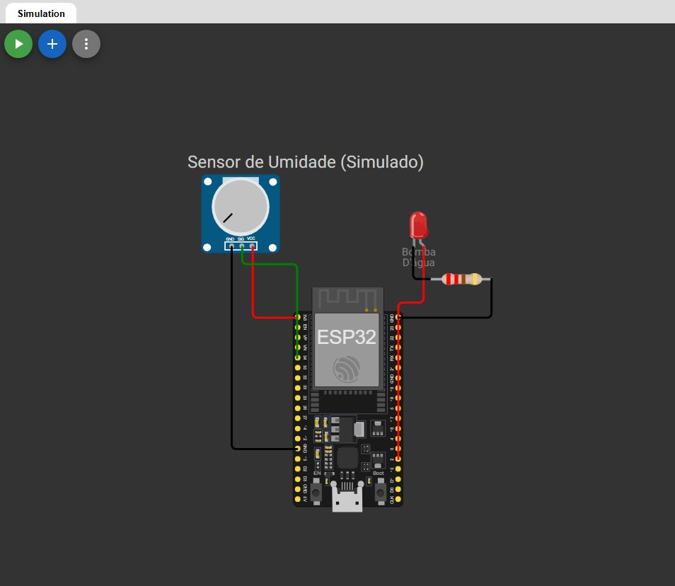

# 🍌 Bananup: O Futuro do Campo (Global Solution 2025)

> **Solução de Inclusão Produtiva e Monitoramento IoT para Pequenos Agricultores.**

##  Integrantes da Equipe
* **Gabriel Henrique Borges Hombris** - RM: 566553
* **Felipe Kolarevic Santos** - RM: 565230

---

##  Descrição do Problema
Identificamos que pequenos agricultores enfrentam dois grandes desafios: a **invisibilidade comercial**, ficando reféns de atravessadores, e a **falta de dados precisos** sobre suas plantações, gerando desperdício de água e perda de colheitas.

##  Nossa Solução
O **Bananup** é um ecossistema digital que une:
1.  **Marketplace Web:** Conecta o produtor diretamente ao comércio local (B2B), aumentando sua margem de lucro[cite: 66].
2.  **Monitoramento IoT:** Um sistema inteligente que monitora a umidade do solo em tempo real. Ele atua como um "parceiro tecnológico", ativando a irrigação automaticamente em caso de seca crítica e enviando dados para a nuvem.

---

## Aquitetura Técnica e IoT

Visão geral da montagem do circuito com ESP32, sensor e atuador.

### Hardware Utilizado (Simulação)
* **ESP32:** Unidade de processamento e conectividade Wi-Fi.
* **Potenciômetro:** Simula o sensor de umidade do solo (entrada analógica).
* **LED Vermelho:** Simula o atuador (Bomba de Irrigação).

### Explicação Técnica: MQTT e Endpoints
Utilizamos o protocolo **MQTT** (Message Queuing Telemetry Transport) devido à sua leveza e eficiência em redes móveis rurais. A comunicação ocorre através de um Broker Público (`test.mosquitto.org`).

**Tópicos MQTT Utilizados:**
* `bananup/umidade`: O ESP32 publica o valor percentual da umidade (0-100%) lido pelo sensor.
* `bananup/bomba`: O ESP32 publica o status do atuador (`LIGADA` ou `DESLIGADA`) para monitoramento remoto.

---

Instruções de Uso e Replicação

Este projeto consiste em uma simulação IoT no Wokwi integrada via MQTT. Abaixo estão as instruções para executar a simulação.

### Opção A: Execução Rápida (Link Direto)
1. Acesse o projeto público no Wokwi através deste link: **[LINK DO WOKWI AQUI](https://wokwi.com/projects/448261469327814657)**
2. Aguarde o carregamento do ambiente.
3. Clique no botão **"Play"** (ícone verde) no topo da tela.
4. A conexão Wi-Fi e MQTT será estabelecida (acompanhe no Serial Monitor).

### Opção B: Replicação Manual (Do Zero)
Caso deseje replicar o projeto em um novo ambiente Wokwi ou em hardware físico (ESP32):

#### 1. Hardware Necessário
* 1x ESP32 (DevKit V1)
* 1x Potenciômetro (Simulando Sensor de Umidade)
* 1x LED Vermelho (Simulando Bomba de Água)
* 1x Resistor 220Ω
* Jumpers/Fios

#### 2. Conexões (Pinagem)
| Componente | Pino ESP32 | Descrição |
| :--- | :--- | :--- |
| **Potenciômetro (Data)** | GPIO 34 | Entrada Analógica |
| **Potenciômetro (VCC)** | 3V3 | Alimentação |
| **Potenciômetro (GND)** | GND | Terra |
| **LED (Anodo/Positivo)** | GPIO 2 | Saída Digital (Atuador) |
| **LED (Catodo/Negativo)** | GND | Terra (via Resistor) |

#### 3. Dependências (Bibliotecas)
No Library Manager do Arduino IDE ou no `library.txt` do Wokwi, adicione:
* `PubSubClient` (por Nick O'Leary) - para comunicação MQTT.
* `WiFi` (Padrão do ESP32).

#### 4. Execução
1. Copie o código fonte da pasta `/src/sketch.ino` deste repositório.
2. Cole na IDE e faça o upload.
3. Abra o Monitor Serial (Baud Rate 115200) para visualizar os logs.

---
##  Vídeo Explicativo
Assista à demonstração completa da solução, incluindo o funcionamento do código e da plataforma:

**[LINK DO VÍDEO NO YOUTUBE]()**

---

##  Estrutura do Repositório
* `/src`: Código fonte C++ (`.ino`) comentado para o ESP32.
* `diagram.json`: Arquivo de configuração do hardware para o Wokwi.
